<h1 align="center">
  🔬 Optical Cavity Ray Tracing
</h1>

<p align="center">
  <em>A modern, interactive Streamlit application for simulating and visualizing paraxial ray tracing within optical resonators using ABCD matrix formalism.</em>
</p>

<p align="center">
  
  
  
  
  
</p>

<hr/>

## ✨ Features

- **Interactive Visualization:** Visualize paraxial rays bouncing between two spherical mirrors in real-time.
- **ABCD Matrix Formalism:** Built on robust optical physics for calculating ray propagation arrays.
- **Stability Analysis:** Automatically calculates cavity stability parameters ($g_1, g_2$) and visualizes them on a stability diagram.
- **Pre-configured Presets:** Quickly load standard configurations such as Confocal, Concentric, Hemispherical, or create your own asymmetric cavities.
- **Stunning Animations:** Generate smooth, animated Plotly figures tracing the path of the light rays.
- **Export Ready:** Export high-quality static figures (PNG) and dynamic animations (GIF/MP4) directly from the UI.
- **Customizable Themes:** Dynamic UI theming engine for dark, light, and colorful semantic styling.

---

## 🖼️ Gallery

Here are some sample outputs generated directly by the application:

### Concave-Concave Cavity
<p align="center">
  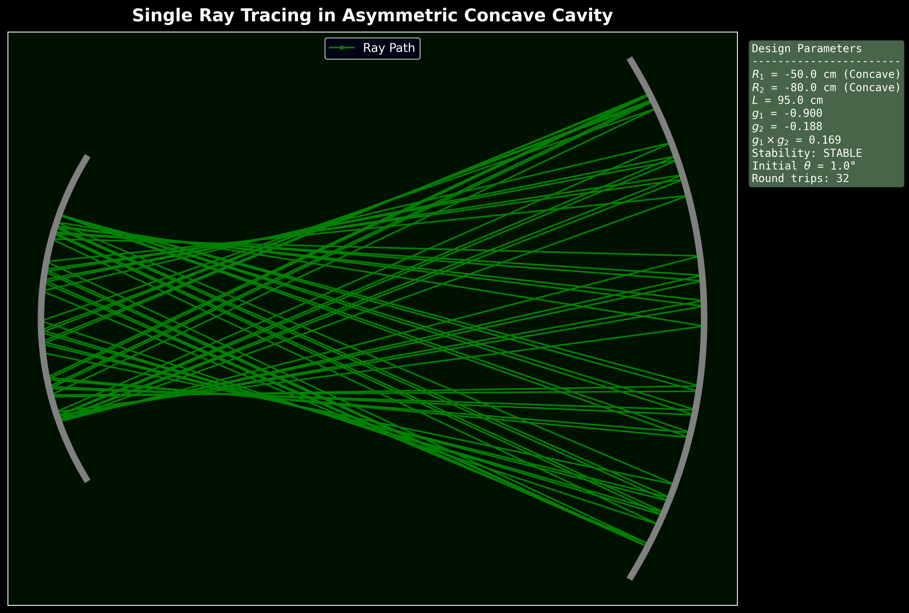
  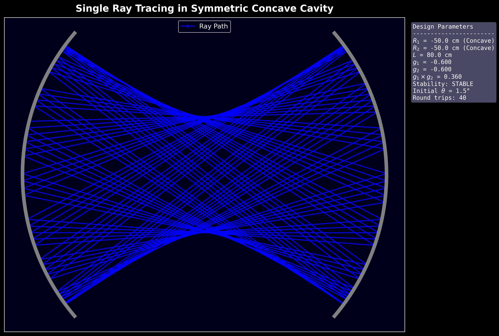
</p>

### Concave-Convex Cavity
<p align="center">
  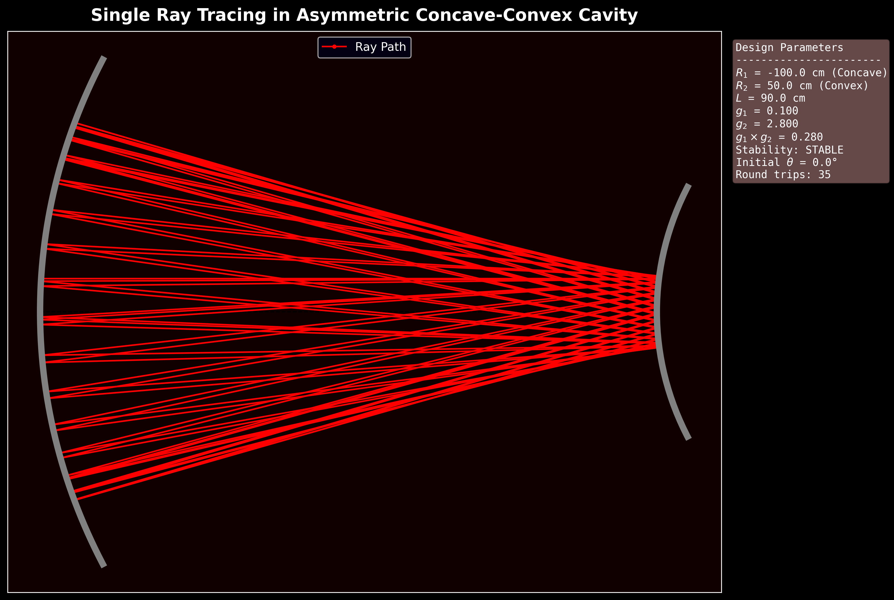
  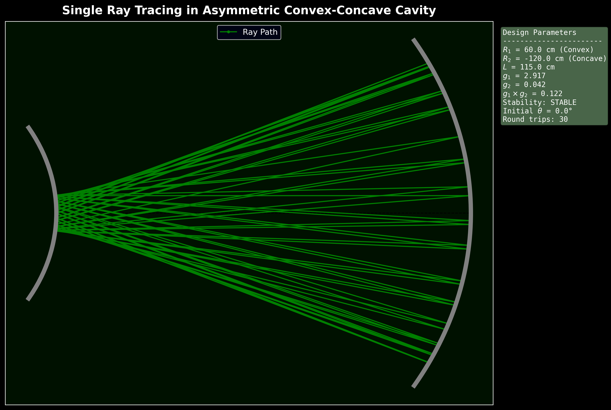
</p>

### Confocal Cavity (Stable)
<p align="center">
  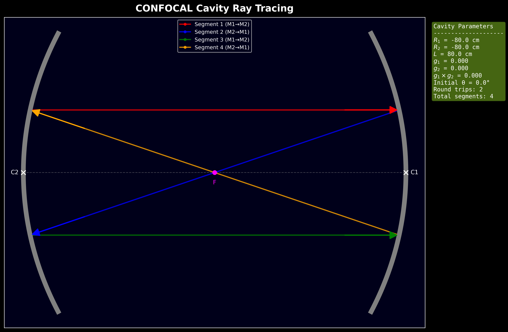
</p>

### Multi-Ray Bundle
<p align="center">
  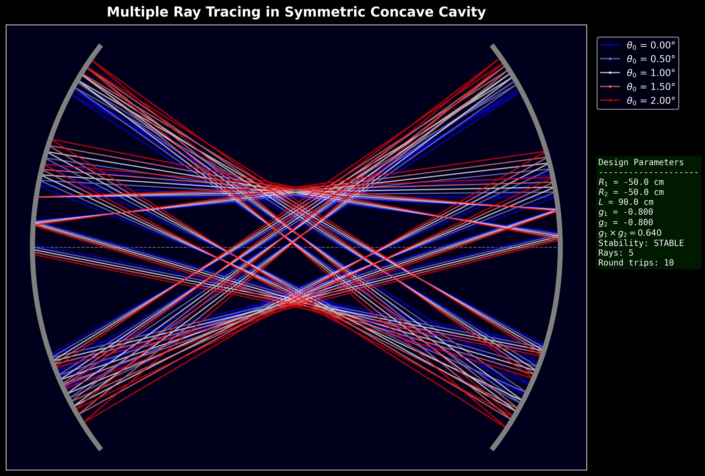
</p>

### Cavity Stability Diagram
<p align="center">
  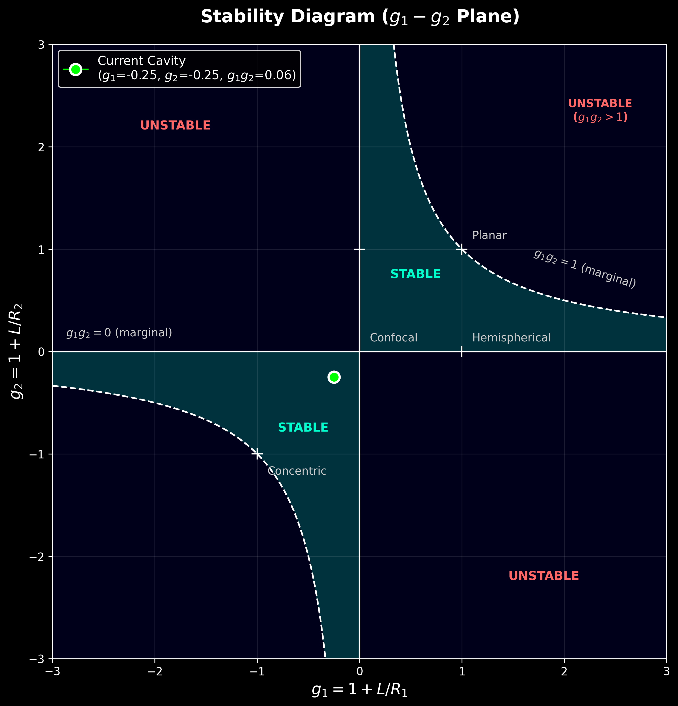
</p>

### Animations

#### Concave-Concave Cavity Animation
<p align="center">
  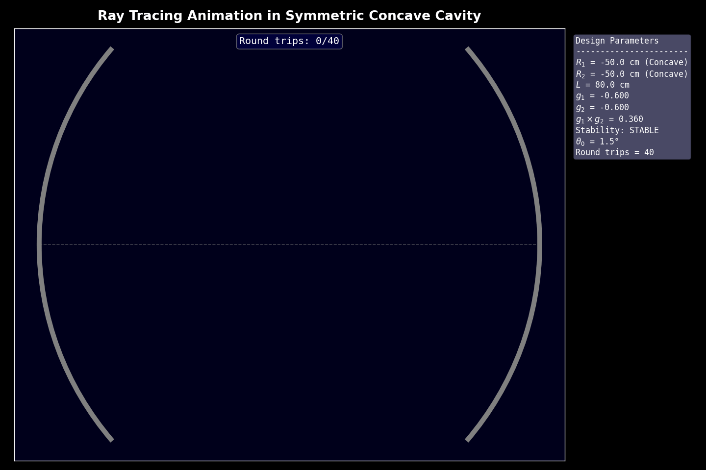
</p>

#### Concave-Convex Cavity Animation
<p align="center">
  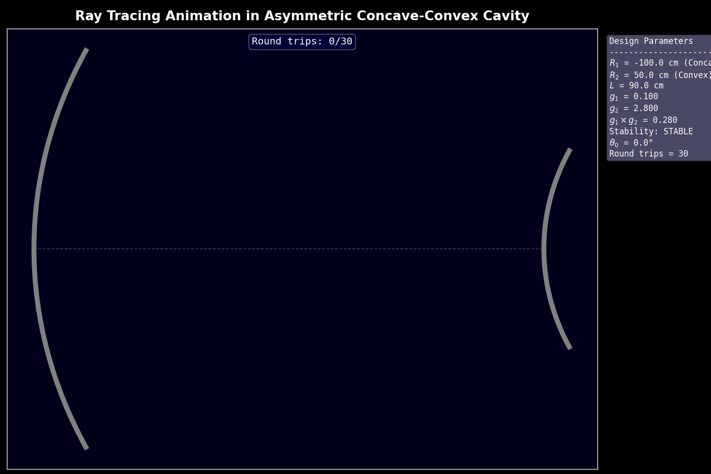
</p>

#### Confocal Cavity Animation
<p align="center">
  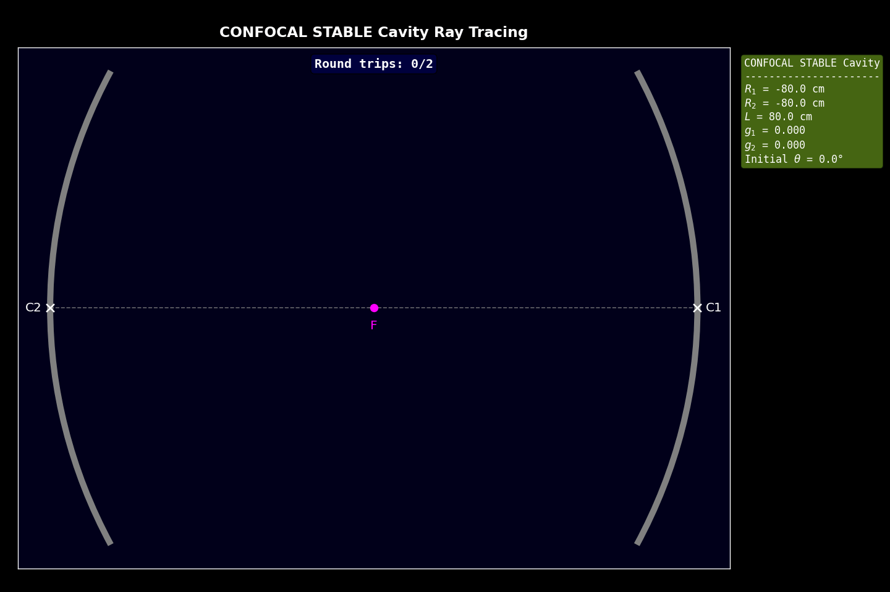
</p>

#### Cavity Bundle Animation
<p align="center">
  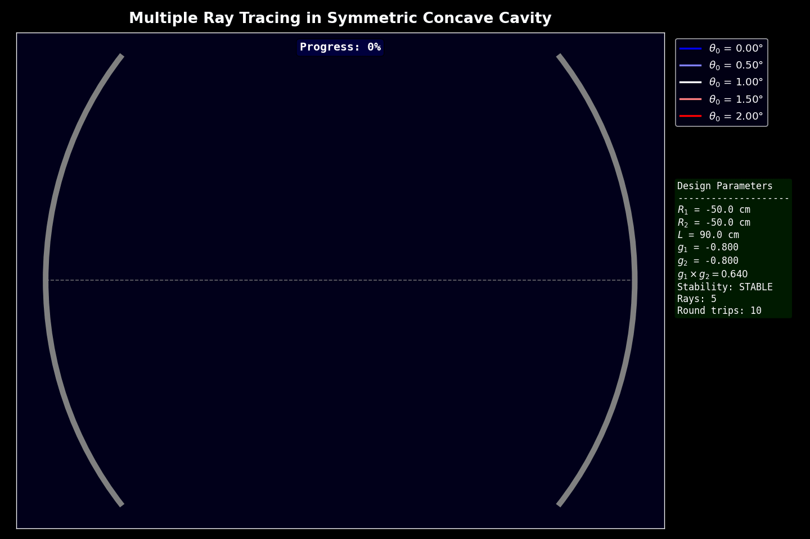
</p>

---

## 📂 Project Structure

```text
├── app.py                     # Streamlit application entry point & UI flow
├── cavity_ray_tracing.py      # Core physics engine (ABCD matrix calculations)
├── plotting.py                # Plotly integration for static & animated figures
├── presets.py                 # Cavity configurations and constants
├── export_utils.py            # PNG and GIF/MP4 export handlers
├── requirements.txt           # Python dependencies
├── themes/                    # Custom Streamlit UI JSON themes
└── OUTPUTS/                   # Directory containing exported artifacts
    ├── ANIMATIONS/            # Generated GIFs and MP4s
    └── PLOTS/                 # Generated PNG figures
```

---

## 🚀 Getting Started

### Prerequisites

Make sure you have Python 3.9+ installed.

### Installation

1. **Clone the repository:**
   ```bash
   git clone https://github.com/your-username/optical-cavity-ray-tracing.git
   cd optical-cavity-ray-tracing
   ```

2. **Install the dependencies:**
   ```bash
   pip install -r requirements.txt
   ```
   *Note: Ensure you have `ffmpeg` installed on your system if you plan to export animations as MP4.*

### Running the App

Launch the application using Streamlit:

```bash
streamlit run app.py
```

The app will open automatically in your default web browser at `http://localhost:8501`.

---

## 🛠️ Usage Notes

1. **Configure the Cavity:** Open the sidebar and choose an initial configuration from the dropdown, or manually tune the Radius of Curvature ($R_1, R_2$) and Cavity Length ($L$).
2. **Ray Parameters:** Adjust the initial ray height ($y_0$) and angle ($\theta_0$), or enable a "Ray Bundle" to visualize multiple paths at once.
3. **Visuals:** Customize colors and theming.
4. **Export:** Scroll to the bottom of the page to export the current static view as a high-resolution PNG or render the ray trace as an animation.

---

## 📜 License

This project is licensed under the MIT License.
